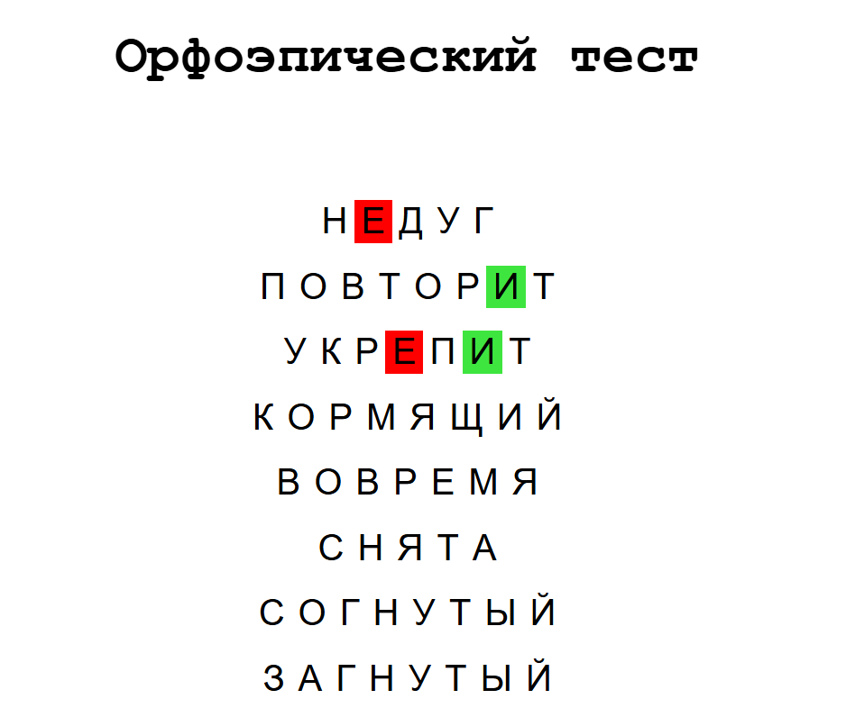

# README: Орфоэпический тест — тренажёр ударений в русском языке

## 📌 О проекте
**Орфоэпический тест** — это интерактивный веб-тренажёр для проверки знаний правильных ударений в русских словах. Проект создан для школьников, студентов и всех, кто хочет говорить грамотно.  

👉 [**Открыть тренажёр**](https://bobr-ik.github.io/orphoepic_test/)  

  

## ✨ Особенности
- **Интерактивная проверка**:  
  - ✅ **Зелёный** — ударение верное.  
  - ❌ **Красный** — ошибка.  
- **Счётчик ошибок** — отслеживает прогресс.  
- **Популярность**: проект используют ученики половины школы!  
- **Простота**: минималистичный дизайн, работает на любых устройствах.  

## 🛠 Технологии
- HTML, CSS, JavaScript  
- GitHub Pages (хостинг)  

## 🚀 Как использовать?
1. Перейдите по [ссылке](https://bobr-ik.github.io/orphoepic_test/).  
2. Кликайте на гласные буквы в словах, чтобы поставить ударение.  
3. Смотрите реакцию системы и исправляйте ошибки.  

## 🤝 Как поддержать проект?
- **Сообщайте об ошибках** в Issues.  
- **Предлагайте новые слова** для теста.  
- Поделитесь ссылкой с друзьями!  

---

Разработано с ❤️ для грамотной речи!